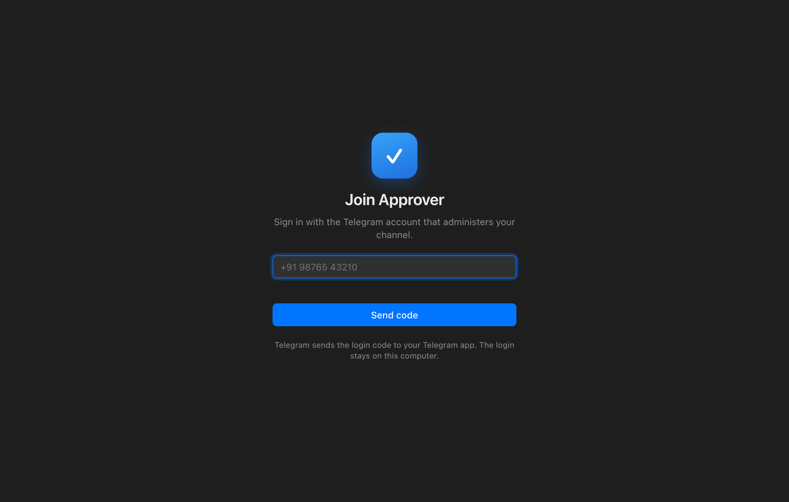
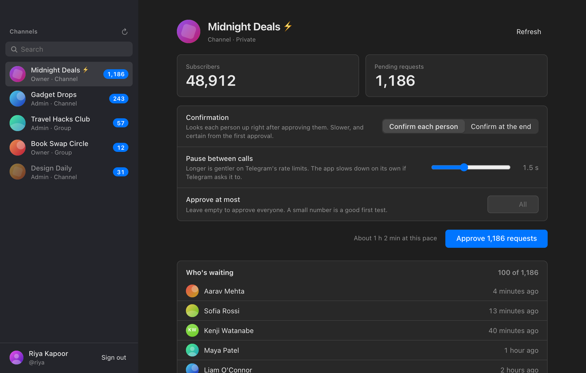
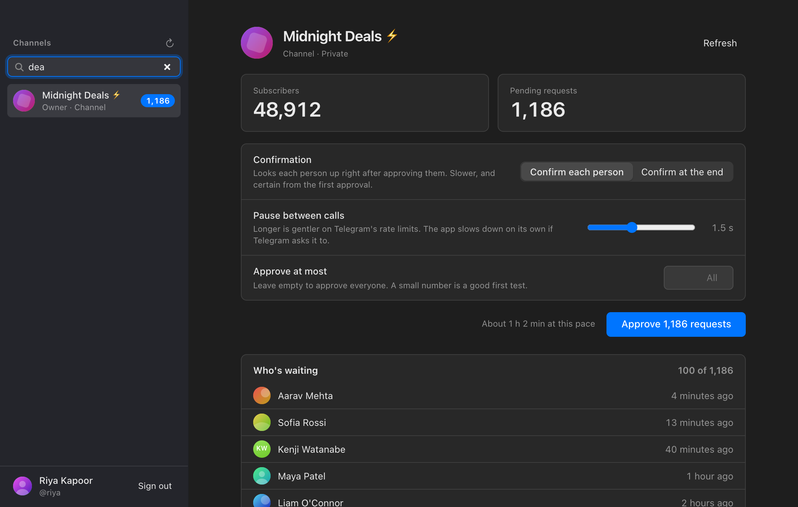
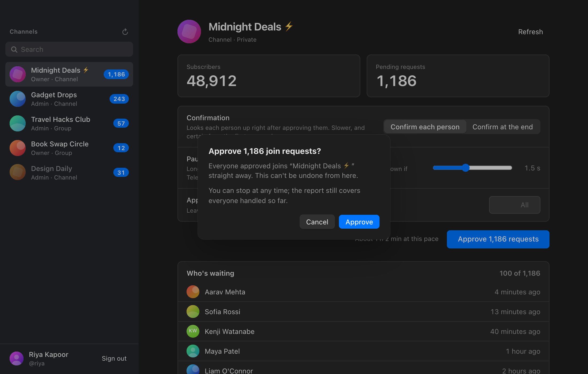
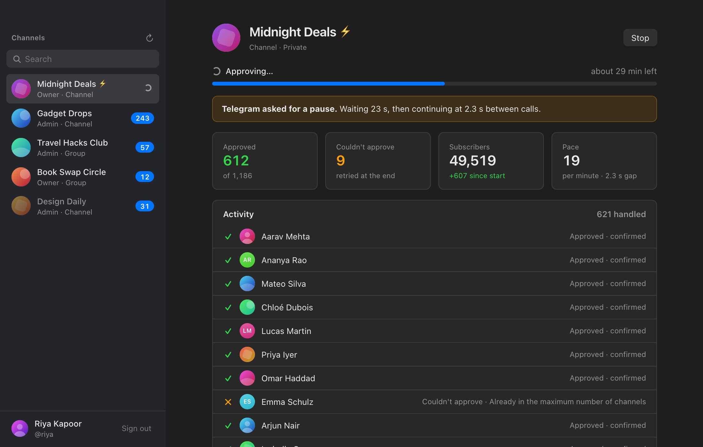
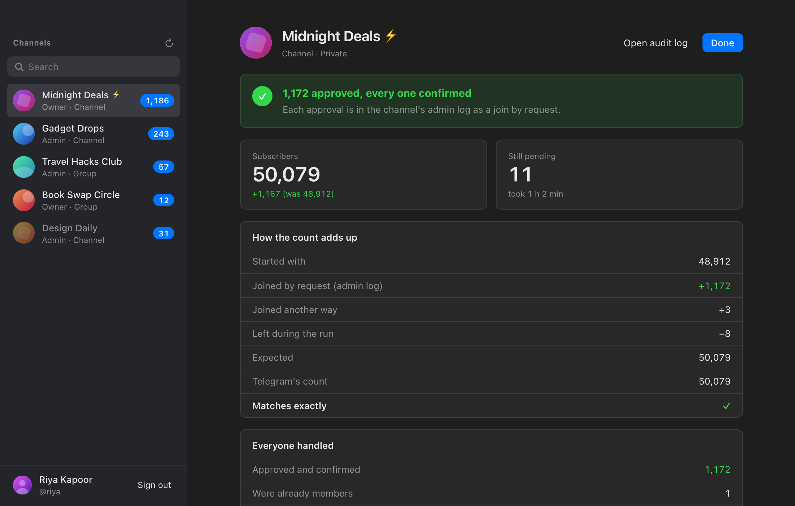
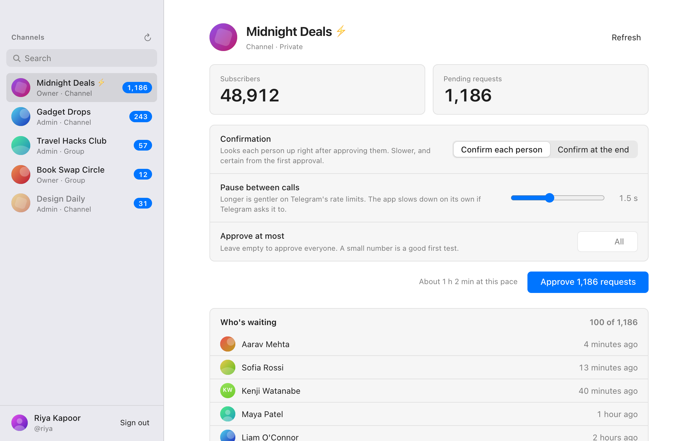
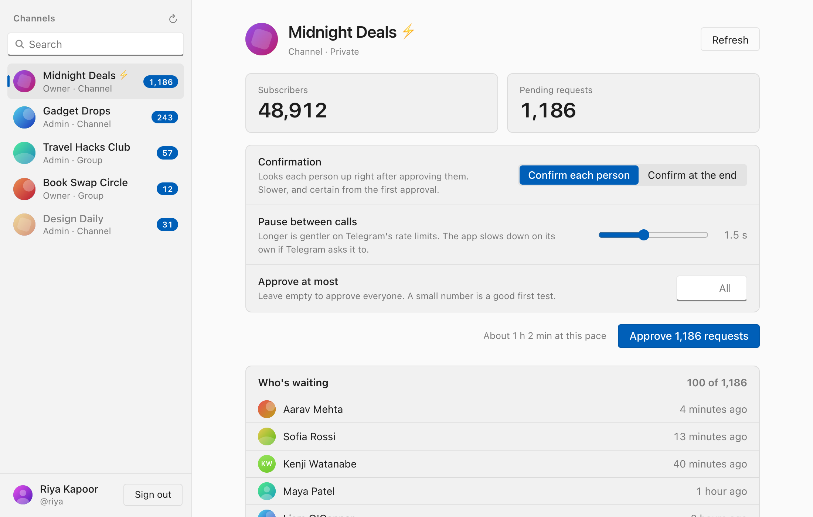

# Join Approver

**Download:** [latest release](https://github.com/Lulzx/join-approver/releases/latest) (macOS `.dmg`, Windows `-setup.exe`). Installed copies update themselves.

A small desktop app (macOS and Windows) that approves a Telegram channel's
pending join requests and proves that each one landed.

[](docs/demo.mp4)

*[Watch with sound](docs/demo.mp4) (26 s).*

Sign in with the Telegram account that owns or administers the channel, pick
the channel, press **Approve**. The app:

- lists only channels and groups you own or administer, with each one's
  subscriber and pending counts, searchable (⌘F / Ctrl+F);
- shows who's waiting a page (100) at a time, with **Show more** to load the
  next page;
- approves one person at a time and confirms each one, either by looking them
  up straight away or by checking the channel's admin log at the end;
- re-reads the pending list until nothing approvable is left, so requests
  that arrive mid-run aren't missed, and retries anything Telegram refused;
- spaces every call out and slows down for good whenever Telegram asks for a
  pause, showing the wait on screen;
- ends with a report: subscribers before and after, the change explained
  from the admin log (joins, leaves, removals), and everyone who couldn't be
  approved, with Telegram's reason;
- writes every attempt to a JSONL audit log (**Open audit log** in the
  report).

The login, the channel list, the counts and the profile pictures are cached
in the app's data folder, so the window opens on the last known state at
once. Signing out deletes all of it.

## Screenshots

| | |
| --- | --- |
|  Sign in with your Telegram account |  Your channels, counts and who's waiting |
|  Search channels (⌘F / Ctrl+F) |  One confirmation before anything happens |
|  Every approval confirmed, Telegram's pauses shown |  The report: the subscriber count, explained |
|  Light mode on macOS |  On Windows |

The screenshots and the demo use made-up channels and people.

## Building

Needs Rust (via rustup), Bun, and a Telegram API ID/hash from
<https://my.telegram.org>, compiled into the app so users don't need their
own. Put them in `.env` (never committed):

```
TG_API_ID=123456
TG_API_HASH=0123456789abcdef0123456789abcdef
```

```sh
bun install
bun run tauri dev                                         # run locally
bun run tauri build --target universal-apple-darwin       # macOS .app + .dmg
```

Windows, cross-compiled from a Mac (`brew install llvm lld nsis`,
`cargo install cargo-xwin`):

```sh
PATH="$HOME/.cargo/bin:/opt/homebrew/opt/llvm/bin:/opt/homebrew/opt/lld/bin:$PATH" \
  bun run tauri build --runner cargo-xwin --target x86_64-pc-windows-msvc
```

Outputs land in `src-tauri/target/<target>/release/bundle/`.

## Releasing

```sh
bun run release                       # patch: 0.1.0 -> 0.1.1
bun run release minor --notes "..."   # or major, or an exact 1.2.3
bun run release --dry-run             # build and stage only
```

Bumps the version, builds both platforms, signs the update bundles, commits
and tags the bump, pushes, and publishes a GitHub release with
`latest.json`, which installed copies poll. Needs the update key at
`~/.tauri/join-approver.key` with its password in the Keychain as
`join-approver-updater`; lose the key and installed copies can't be updated
any more.

## Notes

- `grammers-crypto` 0.10 doesn't build against `glass_pumpkin` 2.0.0-rc1;
  `Cargo.lock` pins rc0. Don't `cargo update` that one.
- The builds aren't code-signed. macOS users open the app the first time with
  right-click → Open; Windows SmartScreen shows "More info → Run anyway".
- The demo video is made with [fframes](https://github.com/dmtrKovalenko/fframes),
  with background shaders ported from
  [Shader Effects](https://github.com/shader-effects-inc/shaders) (MIT). The
  beat is original, synthesized for the video. Its source is in [`demo/`](demo).
